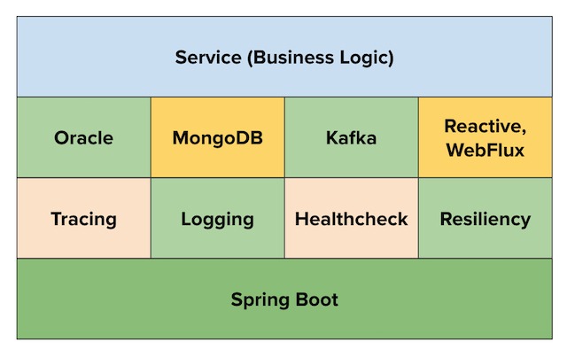

# WellsFargo Application Starter Cookbook

Cookbook contains recipes to help developers complete tasks required to build a fully functional spring boot microservice using the starters.  

Cookbook was created by VMware Tanzu Labs - Solution Architects (Prashanth _PB_ Belathur and Rohan Mukesh) during the WellsFargo Enterprise Architecture Consulting engagement and, can be deployed to PCF as a web application.

## CONTEXT

The application starters in Gitlab will help Wells Fargo developers to create _non-reactive_ or _reactive_ microservices based on the business need:
- **greenfield-app-starter** for migrating a _legacy application_ to a cloud-ready microservice.
- **greenfield-reactive-app-starter** for _greenfield applications_, to take advantage of the non-blocking behavior which improves application performance and resiliency.

Both the app starters share a common tech stack, comprising components approved for use within Wells Fargo.

## SOLUTION

### [Build Non-Reactive microservice](#non-reactive-path)

Complete the recipes in following order:
- **Create barebone microservice using the starter**
- **Configure Actuators**
- **Configure Oracle**
- **Configure MongoDB**    

### [Build Reactive microservice](#reactive-path)

Complete the recipes in following order:
- **Create barebone microservice using the starter**
- **Configure Actuators**
- **Configure MongoDB**

## NOTES
- [What is Reactive Programming ?](https://blog.redelastic.com/what-is-reactive-programming-bc9fa7f4a7fc)
- [Essence of Reactive Programming](https://www.scnsoft.com/blog/java-reactive-programming)

### How to update recipes in this cookbook ?

1. Clone this cookbook project from GitHub
2. Create a project in IntelliJ IDE by importing the cookbook project directory
3. To Update an existing recipe:
   - `cd content\recipes-non-reactive` or `\recipes-reactive` or `\common` or `\best-practices`
   - select/edit the appropriate recipe markdown file (.md extension) 
4. cd to the root directory i.e. cookbook project directory
5. Start Hugo locally: `localserver` or `localserver.bat` (windows)
6. Review your latest updates to the recipe(s) in the browser http://localhost:1313
7. Publish your changes: `publish` or `publish.bat` (windows)
8. Deploy the changes to PCF
   - `cd public`
   - `cf push`
9. Verify the latest recipes changes in cookbook hosted in PCF    
